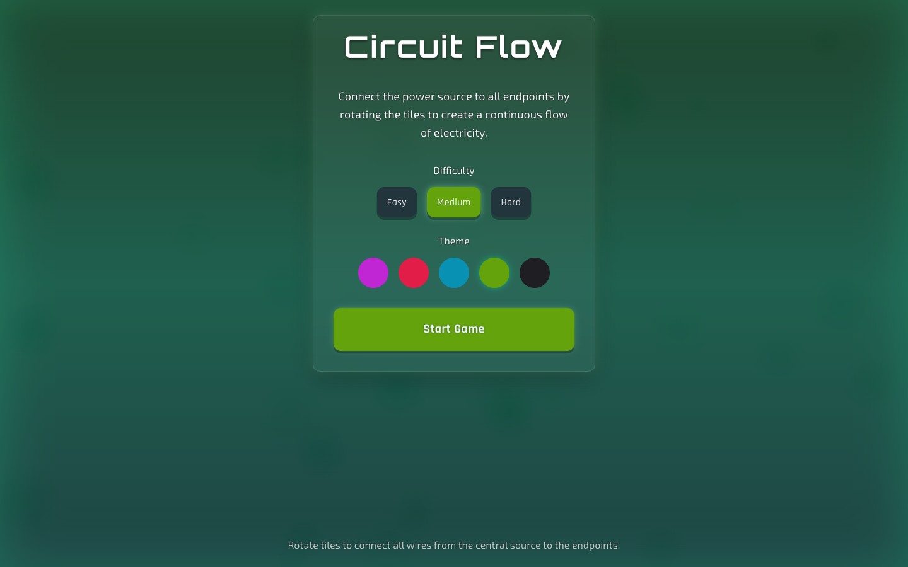

# Circuit Flow

<div align="center">

     

</div>

A circuit-connection puzzle game built with Next.js, TypeScript, and Tailwind CSS. Rotate tiles to route electricity from the power source to every endpoint and light up the board.

## Gameplay

- Click (or tap) any tile to rotate it 90°
- Connect the **power source** to **all endpoints** with an unbroken circuit
- Tiles come in five shapes: straight, corner, T-junction, cross, and end-cap
- Win detection runs after every rotation — complete the circuit to clear the level

## Features

- **Procedural puzzle board** with mixed tile types
- **Undo / redo** support for experimentation without penalty
- **Move counter** and win state tracking
- **Animated tile rotations** via Framer Motion
- **Electric flow visualization** when segments become powered
- **Responsive board** that scales to any screen

## Tech Stack

| Layer | Technology |
|---|---|
| Framework | Next.js 14 (Pages Router) |
| Language | TypeScript |
| Styling | Tailwind CSS |
| Animation | Framer Motion |

## 📸 Screenshots

### Puzzle Board



## Getting Started

### Prerequisites

- Node.js 18+
- npm

### Installation

```bash
git clone https://github.com/iabhishek18/circuit-flow.git
cd circuit-flow
npm install
```

### Development

```bash
npm run dev
```

Open [http://localhost:3000](http://localhost:3000) and start connecting.

### Production Build

```bash
npm run build
npm start
```

## Project Structure

```
├── pages/
│   ├── _app.tsx        # App wrapper, global styles
│   ├── _document.tsx   # HTML document shell
│   └── index.tsx       # Board generation, rotation logic, win detection, UI
├── public/             # Static assets
├── styles/
│   └── globals.css     # Tailwind directives
├── next.config.mjs
├── tailwind.config.ts
└── tsconfig.json
```

## How It Works

Each tile stores its type, rotation, and the compass directions it connects. Rotating a tile remaps its connection set; a flood-fill from the power source then determines which tiles are energized. When every endpoint is reached, the puzzle is solved.

## License

MIT
